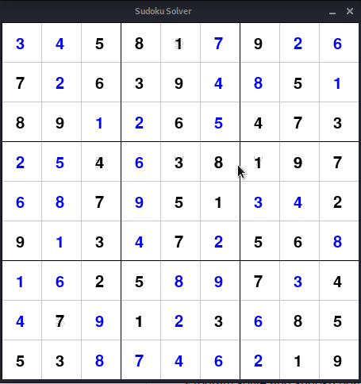

# SudokuSolver

Program solve and sudoku board by Recursion.

How to Install:
```
pip install requirement.txt
```

#### To Run:

Non-GUI
```
python sudoku.py
```

GUI
```
python sudokuGui.py
```
### For GUI version please Check the 'GUI' branch. 
